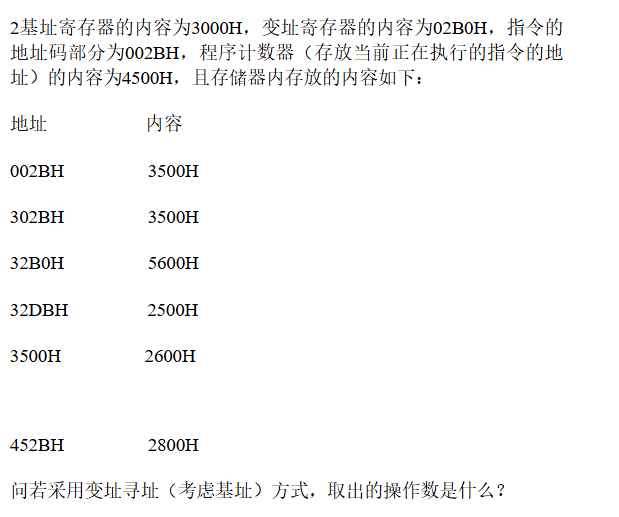

1某计算机指令字长18位，每个操作数的地址码长是6位，指令有无操作数、单操作数和双操作数三种格式，设有N条二操作数指令，M条无操作数指令，问单操作数指令最多可能有多少条

```
操作符，地址1，地址2各占用6位
操作符：2^{6}-N 得 到可用于单操作与无操作指令个数
(64-N)*64 得占用前12位的操作方案
考虑无操作数的方案 必须对前12位既不认成单操作 也不认成双操作
M/64 即可
总方案数算得：(64-N)*64-M/64
```



```markdown

3000H+02B0H+002BH=32DB----->2500H
(基址为总体的偏移)
(变址为下标偏移)
再加上指令的地址部分
```

基址寄存器的内容为3000H，变址寄存器的内容为02B0H，指令的地址码为002BH，程序计数器（存放当前正在执行的指令的地址）的内容为4500H，且存储器内存放的内容如下：

地址 内容

002BH 3500H

302BH 3500H

32B0H 5600H

32DBH 2800H

3500H 2600H

452BH 2500H

（1）、若采用基址寻址方式，则取出的操作数是什么？

（2）、若采用变址寻址（考虑基址）方式，取出的操作数是什么？

（3）、若采用立即寻址方式，取出的操作数是什么？

（4）、若采用存储器间接寻址（不考虑基址）方式，取出的操作数是什么？

（5）、若相对寻址用于转移指令，则转移地址是多少？

```markdown
1. 3000+002B = 302B -> 3500
2. 3000+002B+02B0=32DB -> 2800
3. 002B(立即)
4. 02B0 -> 3500
  3500 -> 2600
5. 4500 + 002B = 452B
```


一台字长为16位的计算机，有16个寄存器，主存容量为8M，具有无操作数、单操作数、双操作数三类指令，其中无操作数指令10个，单操作数指令20个，双操作数指令8个。

指令码的位宽应是多少？

RS型双操作数间接寻址所允许的最大寻址空间是多少？
