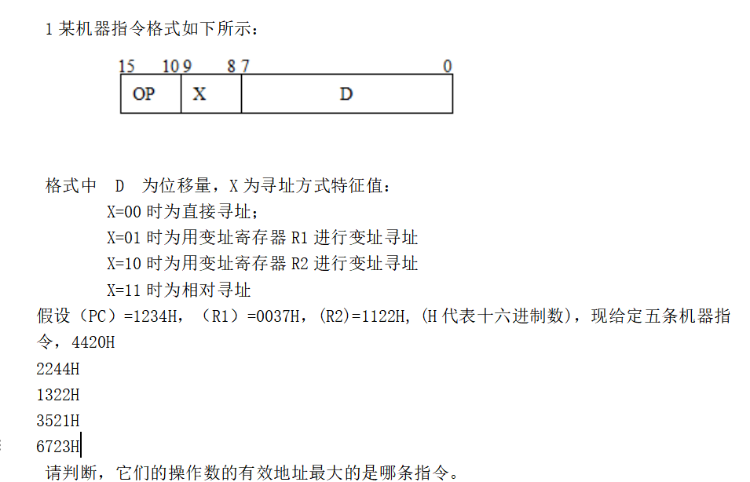
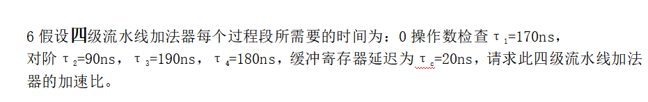
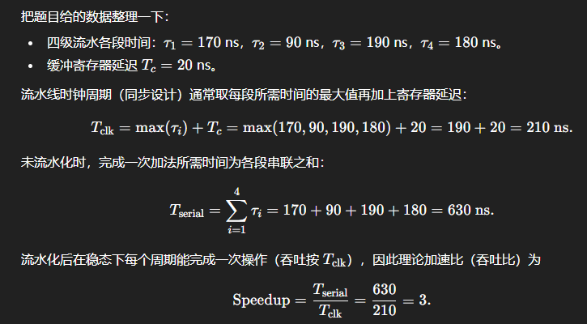
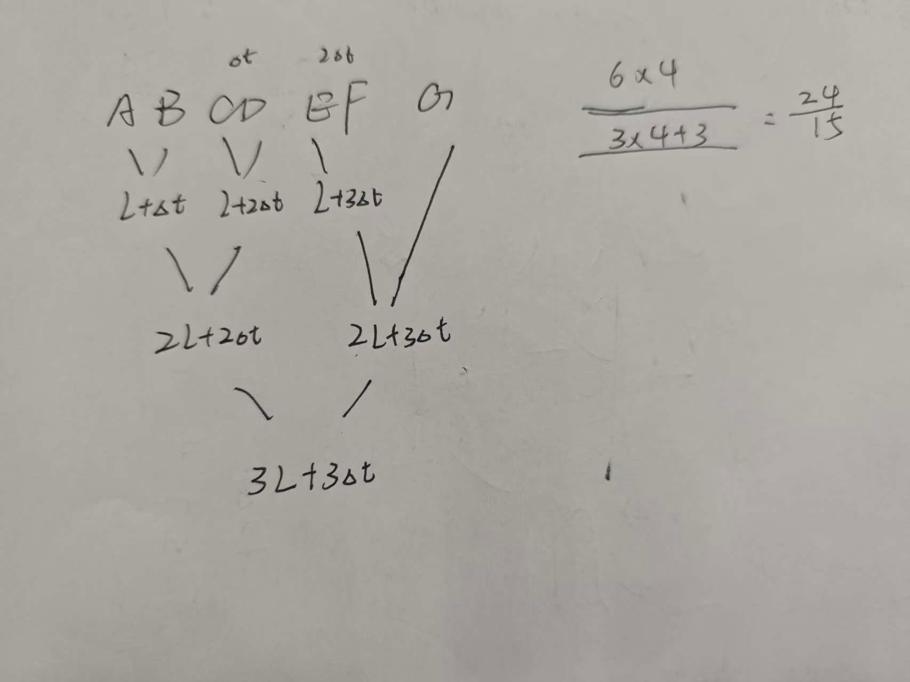
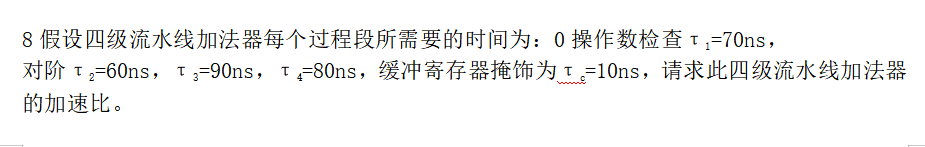
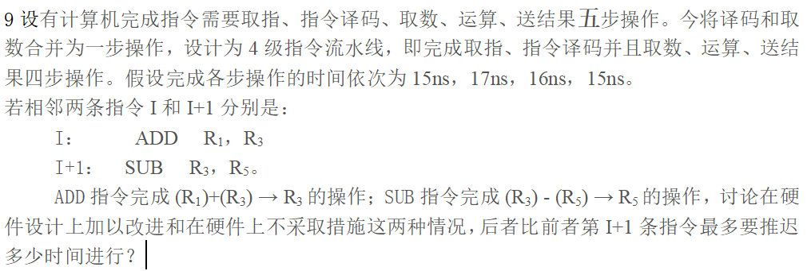

# 概念

微命令 → 微操作 → 微指令 → 微程序 → 机器指令（宏指令）

* **微命令（microcommand）**
  控制**信号**级别的“开关/命令”，比如：

  * `PC_out`：把 `PC` 的内容送上总线
  * `R1_in`：允许寄存器 `R1` 装数
  * `ALU_add`：ALU 执行加法
    实质：**某个控制信号 =1** 就是发出了一个微命令。
* **微操作（micro-operation）**
  对寄存器、总线、存储器等进行的一个 **基本操作（实质操作）** ，在一个时钟周期内完成，如：

  * `R1 ← R2 + R3`
  * `PC ← PC + 1`
    **由若干微命令配合才能实现**一个微操作。
* **微指令（microinstruction）**
  存在于控制存储器中的一“字”，里面包含：

  * 一组控制字段：编码了一批要发出的微命令
  * 顺序控制字段：决定下一条微指令的地址/转移方式
    执行一条微指令时，其中对应的 **多个微命令同时有效 → 触发若干微操作** 。
* **微程序（microprogram）**
  为完成一条（或一类）机器指令而写的一串 **有序微指令序列** 。
  一条机器指令（宏指令）一般对应一个微程序

按执行时序可以这样看：

**微命令 ↔ 微操作**

* 若干微命令在同一节拍内共同作用 → 完成一个微操作。
* 同一个微命令（如 `ALU_add`）可参与多个不同的微操作。

**微指令 → 微命令 / 微操作**

* 一条微指令的控制字段 = “一组微命令的编码”。
* 取出并译码这条微指令 → 得到多个微命令信号 → 在该节拍内完成一组微操作（可以并行）。

**微程序 → 微指令**

* 微程序 = 按一定顺序排列的多条微指令。
* 按微程序里的地址链或条件转移依次取微指令执行。

**机器指令 → 微程序**

控制器根据当前的机器指令操作码，找到对应微程序的入口地址。

执行该微程序中的微指令序列 → 完成这条机器指令。

字段编码方式：

1. 直接编码：一位代表一个微命令（类似于One-hot）
2. 字段直接编码：通过译码器将n位为转为 2^{n}-1种情况(不使用0)
3. 字段间接编码：通过译码器后不直接输出微命令，再经过一次译码后才输出。

## 寻址方式

* 立即数寻址：操作数直接写在指令中，例如常量。
* 寄存器寻址：指令给出寄存器号，操作数在寄存器内，访问速度最快。
* 直接寻址：指令字段给出操作数在主存中的有效地址，执行时直接取数。
* 间接寻址：指令字段存放一个存放有效地址的地址，需要多一次访存取出最终地址。
* 寄存器间接寻址：指令指明寄存器，该寄存器保存有效地址，通过寄存器访问内存。
* 偏移（基址）寻址：用基址寄存器内容 + 指令中的位移量得到有效地址，常用于数组/结构。
* 变址寻址：用指令中的基址/起始地址 + 变址寄存器（通常存放索引）得到有效地址，支持按下标访问。
* 相对寻址：用程序计数器 PC 的当前值 + 指令中的偏移量求出目的地址，常用于分支跳转。
* 堆栈寻址：通过栈顶指针隐式地访问操作数，常见于调用/返回或表达式求值。
* 自增/自减寻址：在寄存器间接的基础上，每次访问后自动对寄存器加或减固定步长，便于遍历数组。

---

# 题目



```markdown
分别对第三位写成二进制
0100 0
0010 R2
0011 PC
0101 R1
0111 PC

故对
0020
1166
1256
0058
1257

```

2某微指令16个控制字段，使用水平微指令格式时，控制位数分别为847615542497656（14），请问可采用何种编码方式，使得控制位数可以减半。

```markdown
字段编码
```

3某机共52个微操作控制信号，构成5个相斥类的微命令组，各组分别包括5,8,2,14，22个微命令。已知可判定的外部条件两个，微指令长28位，请按水平型微指令格式设计微指令，下址字段直接给出后继微指令地址.

```markdown
按题意，用字段编码的水平型微指令，微指令字长 28 位，可设计为：

操作控制字段：18 位
第 1 组（5 个微命令）：3 位
第 2 组（8 个微命令）：4 位
第 3 组（2 个微命令）：2 位
第 4 组（14 个微命令）：4 位
第 5 组（22 个微命令）：5 位
条件字段：2 位（对应 2 个可判定外部条件）
下址字段：8 位（28-18-2）
```

4某微程序控制器中，采用水平型直接控制（编码）方式的微指令格式，后续微指令的地址由微指令的下址字段给出。已知机器共有28个微指令，6个互斥的可判定的外部条件，控存容量为512B x40位。请设计其微指令格式。

```markdown
512B 用来表示地址的话 取对数 log2(512) = 9
6 个互斥的可判定外部条件 + 1= 7 -> 取对数 = 3
28 + 3 + 9 = 40
```

5用一条4段（对阶操作、尾数相加、规格化操作和舍入）浮点加法器流水线求8个浮点数的和：Z＝A1＋B1＋C1＋D1＋E1＋F1＋G1＋H1。已知流水线各段经过时间都是Δt，流水线的输出结果可以直接返回到流水线的输入或暂存于相应的缓存中，其延迟时间忽略不计，流水线为双输入端。求加速比。






7用一条4段（对阶操作、尾数相加、规格化操作和舍入）浮点加法器流水线求7个浮点数的和：Z＝A＋B＋C＋D＋E＋F＋G。已知流水线各段经过时间都是Δt，流水线的输出结果可以直接返回到流水线的输入或暂存于相应的缓寄中，其延迟时间忽略不计，流水线为双输入端。求加速比





```markdown
T流水  = max(t) + tc = 100ns

300/100  = 3
```



```markdown
### 1. 先把流水线搞清楚

合并之后有 **4 级流水线**：

1. 取指 IF：15 ns
2. 译码+取数 ID：17 ns
3. 运算 EX：16 ns
4. 写结果 WB：15 ns

时钟周期要 ≥ 各级最大延迟，所以
[
T = \max(15,17,16,15) = 17 \text{ ns}
]

每一级用 1 个周期，整个指令用 4 个周期流过去。

---

### 2. 两条指令的数据相关

* I : `ADD R1, R3`   —— 完成：  (R1) + (R3) → R3
* I+1 : `SUB R3, R5` —— 需要用到 **新的 R3** 做 (R3) − (R5) → R5

所以 I+1 读 R3 时，必须已经拿到 I 的计算结果，存在 **RAW 数据相关**。

---

### 3. 情形一：硬件做了改进（有旁路 / 前递）

典型做法：结果在 EX 级结束时（周期 3 末）就能通过旁路直接送到下一条指令的 EX 级用，不必等到 WB 写回寄存器。

流水线时序（A=ADD, S=SUB）：

| 周期 | 1  | 2  | 3  | 4  | 5  |
| -- | -- | -- | -- | -- | -- |
| A  | IF | ID | EX | WB |    |
| S  |    | IF | ID | EX | WB |

I+1（SUB）**没有被延迟**，紧跟在 I 后面就行。

---

### 4. 情形二：硬件**不改进**（没有旁路，只能等写回）

此时 SUB 只有在 **ADD 写回完 R3 之后**，才能在 ID 级正确读到新的 R3。
ADD 在第 4 个周期做 WB，R3 在那之后才是新值。

因此 SUB 的 ID 级 **最早只能放在第 5 个周期**。
给出一种安排（只看关键阶段即可）：

| 周期 | 1  | 2  | 3     | 4     | 5  | 6  | 7  |
| -- | -- | -- | ----- | ----- | -- | -- | -- |
| A  | IF | ID | EX    | WB    |    |    |    |
| S  |    | IF | **停** | **停** | ID | EX | WB |

也可以理解为：原本 SUB 的 IF 在第 2 周期，现在被推到第 4 周期开始，本质上就是插入了 **2 个空周期（气泡）**。

---

### 5. 问题问的是：**后者比前者，I+1 指令最多要推迟多少时间？**

* 有硬件改进：I+1 不需要推迟（0 个周期）。
* 无硬件改进：I+1 需要推迟 **2 个时钟周期**。

每个周期是 17 ns：

[
\Delta t = 2 \times 17 \text{ ns} = 34 \text{ ns}
]

---

**答案：**在硬件不改进的情况下，I+1 条指令 **最多要比有改进时推迟 34 ns 执行**（即多插入 2 个时钟周期的等待）。

```

1论述两种控制器设计方式及各自特点

```
硬布线控制器：通过逻辑电路实现控制，速度快但复杂程度高。
微程序控制器：将机器指令转化为每一条微程序，并存储到专门的控制存储器当中去。
```

2何为同步控制方式，举两个例子说明在实际应用中的变化

```markdown
系统中所有时序部件的状态变化，都只允许在统一时钟的某些规定时刻发生，
控制信号和数据的传送都按全局时钟节拍来组织。
```

3请比较水平微指令和垂直微指令

```markdown
水平微指令：
操作码，判断控制，后续地址。
垂直微指令：
微操作码，目标地址，源地址。
比较：
水平微指令可以并行操作，垂直微指令只能串行操作。
```
