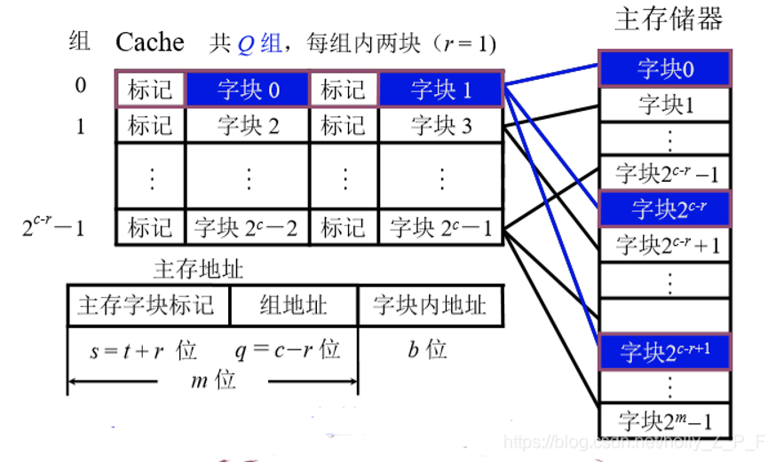
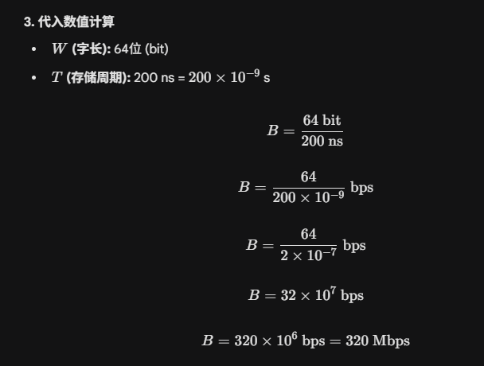

# 知识点

T(总)=T(访问Cache)*p+T(访问内存)(1-p*)



# 题目

1已知cache的读／写时间为10ns，主存的读／写时间为100ns，取指的命中率为98%，数据的命中率为95%，在执行程序时，约有1/5指令需要存／取一个操作数，为简化起见，假设指令流水线在任何时候都不阻塞。问若**采用指令和数据合一**的cache，与无cache比较，计算机的运算速度可提高多少倍？

```markdown
T(有Cache)=10*0.98+110*0.02+(10*0.95+110*0.05)/5=15ns
T(无Cache)=100+100/5=120ns
120/15ns=8
```

已知cache的读／写时间为10ns，主存的读／写时间为110ns，取指的命中率为98%，数据的命中率为95%，在执行程序时，约有1/5指令需要存／取一个操作数，为简化起见，假设指令流水线在任何时候都不阻塞。问若采用**指令和数据合一**的cache，与无cache比较，计算机的运算速度可提高多少倍？

```markdown
T1=10*0.98+120*0.02+(10*0.95+120*0.05)/5=15.3ns
T2=110+110/5=132ns
132/15.3=8.63
```

2已知cache的读／写时间为10ns，主存的读／写时间为100ns，取指的命中率为98%，数据的命中率为95%，在执行程序时，约有1/5指令需要存／取一个操作数，为简化起见，假设指令流水线在任何时候都不阻塞。问若采用**指令和数据分离**的cache，与无cache比较，计算机的运算速度可提高多少倍？

```markdown
T(无)=100+100/5 = 120ns
T(有)=max(10*0.98+110*0.02,(10*0.95+110*0.05)/5)=12ns
120/12=10
```

3CPU执行一段程序时，cache完成存取次数为1900次，主存储器完成的存取次数为100次，已知cache的存取周期为50ns，主存储器的存取周期为250ns，求cache /主存系统的平均访问时间。

```markdown
1900*50+100*300=125,000ns
125,000/2000=62.5ns
```

4设某机主存容量为16MB，Cache的容量为16KB,每字块共8个字，每个字32位。设计一个四路组相联映像的Cache组织，要求：（1）画出主存地址字段中各段的位数（2）设Cache初态为空，CPU依次从主存第0，1，2……99号单元读出100个字（主存一次读出一个字），并重复此次序读8次，问命中率是多少？（3）若Cache的速度是主存速度的6倍，试问有Cache和无Cache相比，速度提高多少倍？

```markdown
一、
总位数16MB->2^{24}B->24位
二、
块的覆盖范围：块大小为8个字。
第1个块（Block 0）包含字地址：0 - 7
第2个块（Block 1）包含字地址：8 - 15...
第13个块（Block 12）包含字地址：96 - 103（涵盖了96-99）。
因此，读取 0-99 号单元共涉及 13 个内存块。
1-13/800=0.98
三、
无：t
有：(t/6)*p+(7t/6)*(1-p)
加速比:5.55

```

5某机字长8位，CPU地址总线16位，数据总线8位，存储器按字节编址，CPU的控制信号线有：MREQ#（存储器访问请求，低电平有效），R/W#（读写控制，低电平为写信号，高电平为读信号）。试问：

1. 若该机主存采用16K×1位的DRAM芯片（内部为128×128阵列）构成最大主存空间，则共需多少个芯片？若采用异步刷新方式，单元刷新周期为2ms，则刷新信号的周期为多少时间？刷新用的行地址为几位？
2. 若为该机配备2K×8位的Cache，每块8字节，采用2路组相联映像，试写出对主存地址各个字段的划分（标出各个字段的位数）；
3. 若主存地址为3280H，则该地址可映像到Cache的哪一组？

---


```markdown
一、
地址总线16位-> 2^{16} = 64K
字拓展 ×4 位拓展 ×8 => 32片
二、
2ms/128 => 15.625us
三、
128阵列->7位译码
```

---

用顺序方式组织内存，设存储器容量为32字，字长64位，模块数m = 4；若存储周期T = 200ns，数据总线宽度为64位，总线传送周期τ= 50ns，则顺序存储器的带宽为？


