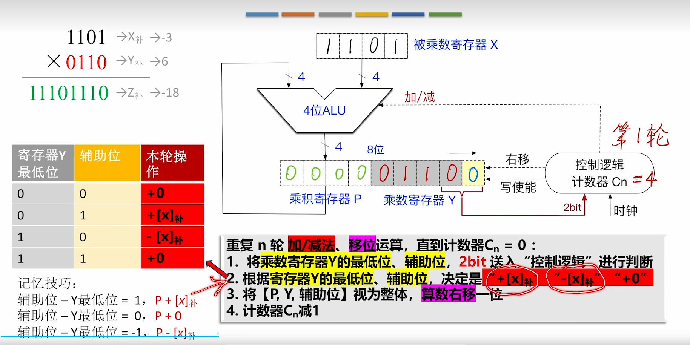
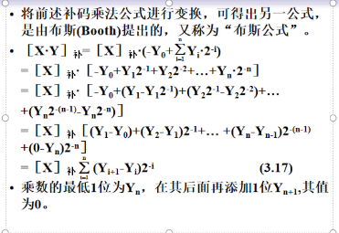
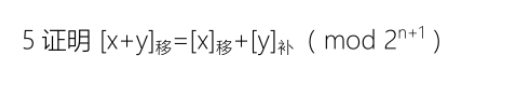
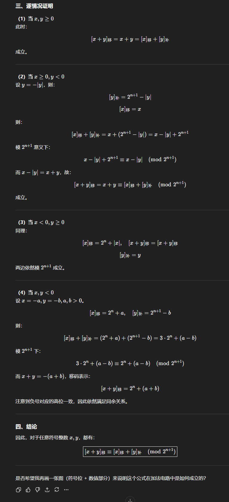
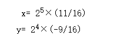

# 知识总结

## 补码的运算

[Y]补 = [-Y]补 所有位取反 + 1

[X+Y]补 = [X]补 + [Y]补

[A]补×[B]补≠[A×B]补

## IEEE754标准

`float 型`偏置值为127

`double 型`偏置值为1023

## 海明校验码：

| k值   | 最小的r值 |
| ----- | --------- |
| 1~4   | 3         |
| 5~11  | 4         |
| 12~26 | 5         |
| 27~57 | 6         |

对于海明位号来说 `Hi`会被所属二进制位 `Pi`用于校验需要满足 `2^p ≥ m + p + 1`

 (P取 1 2 4 8)比方来说

P1可用于校验 H3 H5 H7 H9 H11之后作异或和

## 补码的乘法运算



初始化 `乘积寄存器与辅助位`

循环需要经过n轮

每次取最低两位决定 对被乘数进行何种操作



# 题目

一、选择题（每空1分， 共？分）

1．___D___表示法主要用于表示浮点数中的阶码。

A. 原码         B. 补码

C. 反码      D. 移码

2．下列有关运算器的描述中，__D____是正确的。

A.只做算术运算，不做逻辑运算

B. 只做加法

C.能暂时存放运算结果

D. 既做算术运算，又做逻辑运算

3. CPU主要包括______。

A.控制器           B.控制器、 运算器、cache

C.运算器和主存     D.控制器、ALU和主存

…….

二、判断题（每空1分， 共？分）

计算机中，ALU只能进行逻辑运算。F

逻辑移位是针对无符号数的移位。T

在小数定点机中，原码可以表示-1。F

填空题（每空1分， 共？分）

规格化浮点数的范围取决于__阶码____的位数，精度取决于__尾数____的位数。

四、主观题（每题12分）？（每题10分）

什么是存储程序原理？按此原理，计算机硬件包含哪几个部分？

```markdown
将指令以二进制代码的形式事先输入计算机的主存储器
1. 运算器

- 功能：进行算术运算和逻辑运算
- 核心部件：ALU、累加器（ACC）、通用寄存器等

2. 控制器

- 功能：指挥各部件协调工作，控制程序执行
- 核心部件：程序计数器（PC）、指令寄存器（IR）、控制单元（CU）

3. 存储器

- 功能：存放程序和数据
- 核心部件：存储体、地址寄存器（MAR）、数据寄存器（MDR）

4. 输入设备

- 功能：将外部信息转换为机器能识别的形式输入计算机
- 例如：键盘、鼠标、扫描仪等

5. 输出设备（Output Device）

- 功能：将计算结果转换为人们熟悉的形式输出
- 例如：显示器、打印机等

```

已知A=0.11011，B=－0.11110，用补码一位乘法计算[A×B]

```markdown
初值:  A=000000  Q=100010  Q-1=0   (M=011011, -M=100101)

1) Q0 Q-1=00 → 不操作
   ASR → A=000000  Q=010001  Q-1=0

2) Q0 Q-1=10 → A=A−M = 000000 + 100101 = 100101
   ASR → A=110010  Q=101000  Q-1=1

3) Q0 Q-1=01 → A=A+M = 110010 + 011011 = 001101  （丢弃最高进位）
   ASR → A=000110  Q=110100  Q-1=0

4) Q0 Q-1=00 → 不操作
   ASR → A=000011  Q=011010  Q-1=0

5) Q0 Q-1=00 → 不操作
   ASR → A=000001  Q=101101  Q-1=0

6) Q0 Q-1=10 → A=A−M = 000001 + 100101 = 100110
   ASR → A=110011  Q=010110  Q-1=1
```


```markdown
先忽略阶码
X=1.111
Y=0.101
[X]补=1.001
[Y]补=0.101
[-Y]补 = 1.011
[X] >> 1 = 1.100
X-Y = X+[-Y]补 = 1.100 + 1.011 = 10.111
答案则为: 1.011 × 2 ^ {101}

```

采用IEEE754单精度浮点数格式表示一个数为45110000H,则该数的值是多少？

```markdown
 先拆分为二进制数
0100 0101 0001 0001 0000 0000 0000 0000
符号位：1
阶码：(1000100)|2 - 127 = 5
尾数：001 0001
1.0010001 × 2 ^{5}

```





6 求十进制数―123的原码表示，反码表示，补码表示和移码表示（用8位二进制表示，并设最高位为符号位，真值为7位）。并求十进制数―123的满足754标准的浮点数表示。（求出阶码和尾数）

```markdown
-123
对于123 = 01111011
故：
原 = 111110111
反 = 100001000
补 = 100001001
1 1111 0111 -> 1.1110111 ×  2 ^{7}
阶码 7+127 = 111 + 1000000 - 1 = 10000110
尾数 11101111
则： 1100 0011 0111 1011 1100 0000 0000 0000
= C37BC000(H)

```

7 设X=0.1010,Y=-0.0101,（**看清：X为正，Y为**负）：使用二者原码逐位求逻辑加和逻辑异或.

```markdown
逻辑加即为或运算
X = 0.1010
Y = 1.0101
X | Y = 1.1111

逻辑异或（XOR）：
X = 0.1010
Y = 1.0101
X ⊕ Y = 1.1111

逐位计算：
  0.1010
⊕ 1.0101
--------
  1.1111
（相同为0，不同为1）
```

8 请写出-2024的原码、反码、补码。并给出其754标准浮点的数内存机器数表示

```markdown
2024的二进制表示：11111101000 (11位)
用12位表示：0111 1110 1000

对于-2024（用12位表示，1位符号位+11位数值位）：
原码：1 11111101000 = 1111 1110 1000
反码：1 00000010111 = 1000 0001 0111
补码：1 00000011000 = 1000 0001 1000

IEEE 754单精度浮点数表示（32位）：
2024 = 11111101000 = 1.1111101000 × 2^10
（规格化：小数点前保留1位）

符号位：1（负数）
阶码：10 + 127 = 137 = 10001001 (8位)
尾数：11111010000000000000000 (23位，去掉隐含的1)

完整32位：1 10001001 11111010000000000000000
分组：1100 0100 1111 1101 0000 0000 0000 0000
机器数：C4FD0000(H)
```

9将十进制数-6.625转换为IEEE短浮点数。

```markdown
6.625 = 110.101=1.10101 × 2 ^ {2}
阶码： 10 + 10000000 - 1 = 10000001
尾数 10101
1100 0000 1101 0100 0000 0000 0000 0000
C0D40000(H)

```

10 请比较规格化和非规格化单精度浮点数（float型）的表示范围。

```markdown

```

11 若8位信息为01101101，海明码是何值?

```
需要5个校验位
H1 H2 H4 H8 H13(无需到16)
H1 H2 H3 H4 H5 H6 H7 H8 H9 H10 H11 H12 H13
P1 P2 D1 P3 D2 D3 D4 P4 D5 D6  D7  D8  P5


写出1~13的二进制表示
0001
0010
0011
0100
0101
0110
0111
1000
1001
1010
1011
1100
1101
故 P1 = H3 ^ H5 ^ H7 ^ H9 ^ H11 = D1 ^ D2 ^ D4 ^ D5 ^ D8 = 1
P2 = H6 ^ H7 ^ H10 ^ H12 = D3 ^ D4 ^ D6 ^ D8 = 1
P3 = H5 ^ H6 ^ H7 ^ H12 = D2 ^ D3 ^ D4 ^ D8 = 0
P4 = H9 ^ H10 ^ H11 ^ H12 = D5 ^ D6 ^ D7 ^ D8 = 0
故海明码为：011001100111
```

12 写出1100的汉明码。

```
需要三位海明校验码
H7 H6 H5 H4 H3 H2 H1
D4 D3 D2 P3 D1 P2 P1
1  1  0  0  0  0  1
P1 = H3 ^ H5 ^ H7 = D1 ^ D2 ^ D4 = 1
P2 = H3 ^ H6 ^ H7 = D1 ^ D3 ^ D4 = 0
P3 = H5 ^ H6 ^ H7 = D2 ^ D3 ^ D4 = 0
```



阶码取3位，尾数取6位（均不包括符号位，符号位单独取两位），按浮点数补码运算规则计算两数的和，且给出十进制的值

```
x = 0.1011 × 2^{5}
y = -0.1001 × 2^{4}
[y]补 = 1.0111 >> 1 = 1.1011
[x]补 = 0.1011 

[x+y]补 = [x]补 + [y]补 = 0.1011 + 1.1011 = 10.0110
舍去溢出位得 0.0110
ans = 0.1100 × 2^{5}
```
