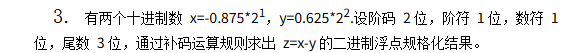

## 知识总结

[Y]补 = [-Y]补 所有位取反 + 1

[X+Y]补 = [X]补 + [Y]补

[A]补×[B]补≠[A×B]补

`float 型`偏置值为127

`double 型`偏置值为1023

# 题目

一、选择题（每空1分， 共？分）

1．___D___表示法主要用于表示浮点数中的阶码。

A. 原码         B. 补码

C. 反码      D. 移码

2．下列有关运算器的描述中，__D____是正确的。

A.只做算术运算，不做逻辑运算

B. 只做加法

C.能暂时存放运算结果

D. 既做算术运算，又做逻辑运算

3. CPU主要包括______。

A.控制器           B.控制器、 运算器、cache

C.运算器和主存     D.控制器、ALU和主存

…….

二、判断题（每空1分， 共？分）

计算机中，ALU只能进行逻辑运算。F

逻辑移位是针对无符号数的移位。T

在小数定点机中，原码可以表示-1。F

填空题（每空1分， 共？分）

规格化浮点数的范围取决于__阶码____的位数，精度取决于__尾数____的位数。

四、主观题（每题12分）？（每题10分）

什么是存储程序原理？按此原理，计算机硬件包含哪几个部分？

```markdown
将指令以二进制代码的形式事先输入计算机的主存储器
1. 运算器

- 功能：进行算术运算和逻辑运算
- 核心部件：ALU、累加器（ACC）、通用寄存器等

2. 控制器

- 功能：指挥各部件协调工作，控制程序执行
- 核心部件：程序计数器（PC）、指令寄存器（IR）、控制单元（CU）

3. 存储器

- 功能：存放程序和数据
- 核心部件：存储体、地址寄存器（MAR）、数据寄存器（MDR）

4. 输入设备

- 功能：将外部信息转换为机器能识别的形式输入计算机
- 例如：键盘、鼠标、扫描仪等

5. 输出设备（Output Device）

- 功能：将计算结果转换为人们熟悉的形式输出
- 例如：显示器、打印机等

```

已知A=0.11011，B=－0.11110，用补码一位乘法计算[A×B]

```markdown
[A]补X[B]补≠[AXB]补
初始置辅助位为0 
辅助位 - MQ中最低位 = 1时，(ACC)+[x]补
辅助位 - MQ中最低位 = 0时，(ACC)+0
辅助位 - MQ中最低位 = -1时，(ACC)+[-x]补
[A]补=0.11011
[B]补=1.00010
[-A]补=1.00101
初始：积寄存器|乘数寄存器|辅助位

```



```markdown
先忽略阶码
X=1.111
Y=0.101
[X]补=1.001
[Y]补=0.101
[-Y]补 = 1.011
[X] >> 1 = 1.100
X-Y = X+[-Y]补 = 1.100 + 1.011 = 10.111
答案则为: 1.011 × 2 ^ {101}

```

采用IEEE754单精度浮点数格式表示一个数为45110000H,则该数的值是多少？

```
 先拆分为二进制数
0100 0101 0001 0001 0000 0000 0000 0000
符号位：1
阶码：(1000100)|2 - 127 = 5
尾数：001 0001
1.0010001 × 2 ^{5}

```

5 证明 [x+y]~移~=[x]~移~+[y]~补 ~（mod 2^n+1^）

6 求十进制数―123的原码表示，反码表示，补码表示和移码表示（用8位二进制表示，并设最高位为符号位，真值为7位）。并求十进制数―123的满足754标准的浮点数表示。（求出阶码和尾数）

```
-123
对于123 = 01111011
故：
原 = 111110111
反 = 100001000
补 = 100001001
1 1111 0111 -> 1.1110111 ×  2 ^{7}
阶码 7+127 = 111 + 1000000 - 1 = 10000110
尾数 11101111
则： 1100 0011 0111 1011 1100 0000 0000 0000
= C37BC000(H)

```

7 设X=0.1010,Y=-0.0101,（**看清：X为正，Y为**负）：使用二者原码逐位求逻辑加和逻辑异或.

```
逻辑加即为或运算
X = 0.1010
Y = 1.0101
X | Y = 1.1111

逻辑异或（XOR）：
X = 0.1010
Y = 1.0101
X ⊕ Y = 1.1111

逐位计算：
  0.1010
⊕ 1.0101
--------
  1.1111
（相同为0，不同为1）
```

8 请写出-2024的原码、反码、补码。并给出其754标准浮点的数内存机器数表示

```
2024的二进制表示：11111101000 (11位)
用12位表示：0111 1110 1000

对于-2024（用12位表示，1位符号位+11位数值位）：
原码：1 11111101000 = 1111 1110 1000
反码：1 00000010111 = 1000 0001 0111
补码：1 00000011000 = 1000 0001 1000

IEEE 754单精度浮点数表示（32位）：
2024 = 11111101000 = 1.1111101000 × 2^10
（规格化：小数点前保留1位）

符号位：1（负数）
阶码：10 + 127 = 137 = 10001001 (8位)
尾数：11111010000000000000000 (23位，去掉隐含的1)

完整32位：1 10001001 11111010000000000000000
分组：1100 0100 1111 1101 0000 0000 0000 0000
机器数：C4FD0000(H)
```

9将十进制数-6.625转换为IEEE短浮点数。

10请比较规格化和非规格化单精度浮点数（float型）的表示范围。

11 若8位信息为01101101，海明码是何值?

12 写出1100的汉明码。

13 x= 2^5^×(11/16)

y= 2^4^×(-9/16)

阶码取3位，尾数取6位（均不包括符号位，符号位单独取两位），按浮点数补码运算规则计算两数的和，且给出十进制的值
