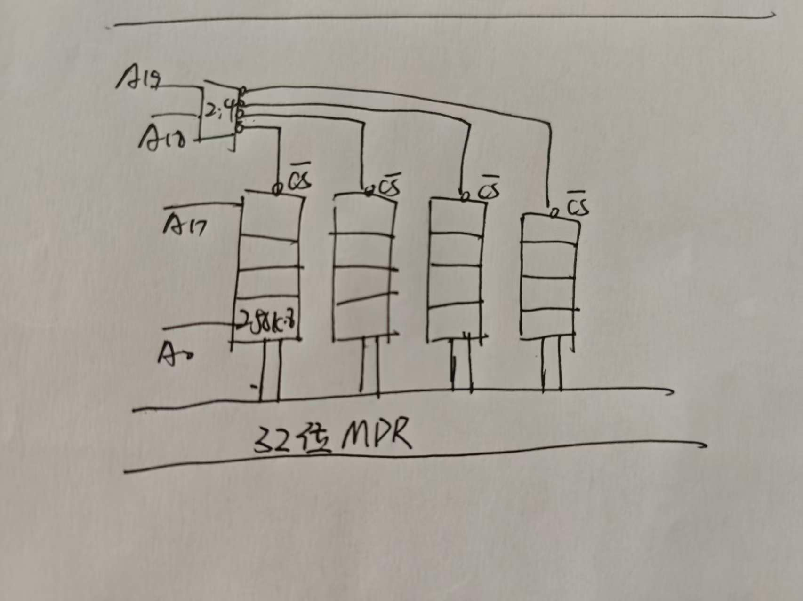
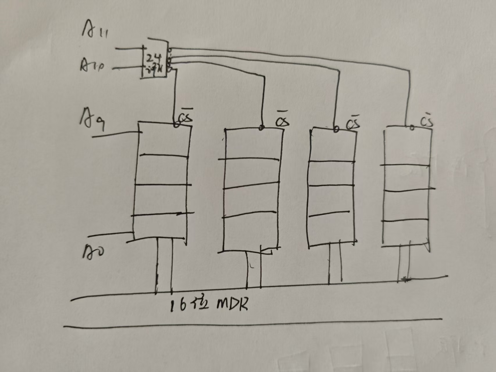
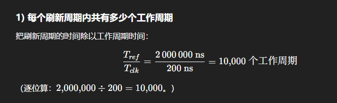
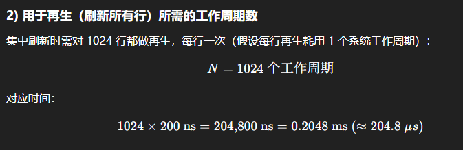
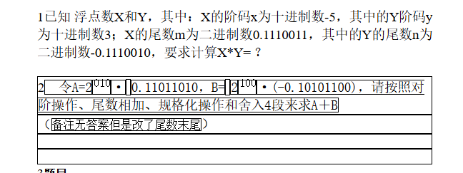
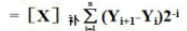

## 数据总线与地址总线

主存最大容量由 地址总线位数 决定（还取决于“按什么单位编址”）；数据总线位数不决定容量，只影响一次传输的数据量/字长与带宽。

## 主存芯片的拓展

字拓展：利用译码器

* [ ] 位拓展：将每一位连接到不同的地址总线上

# 题目

1某32位计算机，CPU的地址总线36位，数据总线32位，存储器按字编址。

该机最大主存容量为多少字节？

CPU中的MAR和MDR分别为多少位？

现有若干个1 M*4位的DRAM芯片，用于形成该机512 M *32位的RAM存储区域，共需要多少片DRAM芯片？

```markdown
最大主存容量：2^36 字 × 4B/字 = 2^38 B = 256 GiB（≈256 GB）
MAR、MDR 位宽：MAR = 36 位；MDR = 32 位
需要的 DRAM 片数：每字32位需 32/4 = 8 片并联；深度 512M/1M = 512 组 ⇒ 8 × 512 = 4096 片
```

2设CPU有20根地址线，8根数据线。并用IO/M做访存控制信号。RD为读命令，WR为写命令。现有8K*8位RAM若干以及译码器和门电路芯片若干。

系统可访问的最大存储空间是多少？

要求最小16K为系统程序区，最后32K为用户程序区，请分别写出系统程序区以及用户程序区的地址范围。

```
①：看地址线数目：2^20 = 1M
格式 00000(H)
②：系统放低地址区： 00000(H) ~ 16k(开) = 03FFF(H)
   用户放高地址区： F8000(H)~FFFFF(H) (FFFFF(H)-32K+1)
```

已知：机器字长：8 位 CPU 地址总线：16 位 数据总线：8 位

存储器按字节编址

CPU 的控制信号线有：

**MREQ#** （存储器访问请求，低电平有效）

**R/W#** （读写控制，低电平为写信号，高电平为读信号）

(1) 若该机主存采用 16K×1 位的 DRAM 芯片（内部为 128×128 阵列）构成最大主存空间，

则共需多少个芯片？若采用异步刷新方式，单元刷新周期为 2 ms，

则刷新信号的周期为多少时间？刷新用的行地址为几位？

```markdown
由地址总线得内存容量 2 ^ {16} = 64kb
若需要组成 64k 8位芯片 则需要 4 × 8 = 32 块芯片
单元刷新2ms 则 行刷新时间 2/128 ms
行地址本质为译码器的输入 因此 只需要取对数 log2(128) = 7
```

有一个具有 20 位地址和 32 位字长的存储器，它是由 256K×8 位的 DRAM 芯片构成。

请画出该存储器的组成逻辑框图。

```
20 位地址位为 1M 
256K 需要拓展 需要 *4
位数也需要 *4


```

5. 某系统原为单字宽主存，一次读写一个字。访问一次存储器需要 1 个时钟周期传地址，1 个时钟周期传数据，4 个时钟周期读写数据。

后改为四字宽主存，一次读写四个字,但cpu与主存的数据传送宽度为1个字。请以读取 16 个字为例，比较其所需的时钟周期？

```
1(传地址)+1(传数据)+4(读写) = 6
T(原)=6*16=96
T(现)=6*16/4+3=24+3=27(最后三个周期传数据给cpu)
```


6有一个4K×16位的存储器，由1K×4位的DRAM芯片构成（芯片是64×64结构）。请 画出存储体的组成框图。

```
字扩展 ×4
位扩展 ×4

```



一个存储器有1 024行，系统工作周期为200ns。RAM刷新周期为2ms。问集中刷新情况下每个刷新周期内共有多少个工作周期，其中用于再生的为多少个工作周期，用于读和写的为多少个工作周期?





```
问集中刷新情况下每个刷新周期内共有多少个工作周期:
10000-1024=8976
```

3 第三章算力的其它题目

已知小数A和B和C的补码表示分别为11.0011,00.1011和11.1011，并且A和B的乘积的补码表示为11.01110001，请求出以补码表示的A和C的乘积。（115讲解！）

```

```

解：



```
分别相乘就行
x*y = -2
m*n =>
1.1110011 * -1.1110010 = -11.1001101101110
答案 
-1.11001101101110 * 2^{-1}
```

2 令A=2^010^· 0.11011010，B= 2^100^·(-0.10101100)，请按照对阶操作、尾数相加、规格化操作和舍入4段来求A＋B

（备注无答案但是改了尾数末尾）

```
A =  2 ^ {100} * 0.0011011010
A+B = 0.0011011010 + -0.10101100=-0.0111010110
得 -1.1101 * 2^{2}
```

3题目

 设[x]~补~=x~0~.x~1~x~2~…x~n~, 求证：

[x/2]补= x~0~. x~0~x~1~x~2~…x~n~

```
相当于作右移
符号位补x0
得 x0.x0x1x2....xn
```

4请通过公式推导说明补码乘法中累加的部分积可以由乘数的相邻两位决定。（115讲解！）

```
初始ans = 0 辅助位 =0
每次取最低两位 
if (bit[i] - bit[i-1]) == 1 ans += 被乘数
elif (bit[i] - bit[i-1]) == -1 ans -= 被乘数
公式可写成 ans = sigma(0~n)(被乘数*(bit[i]-bit[i-1]))

```


