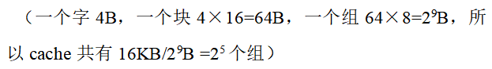
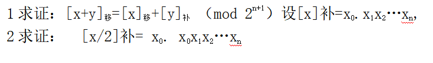
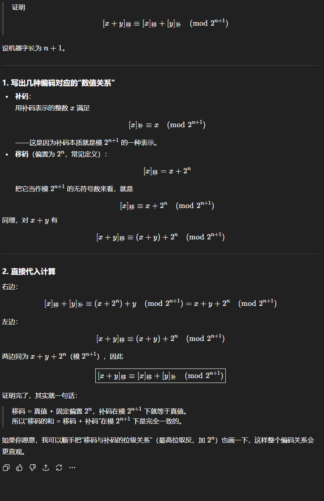
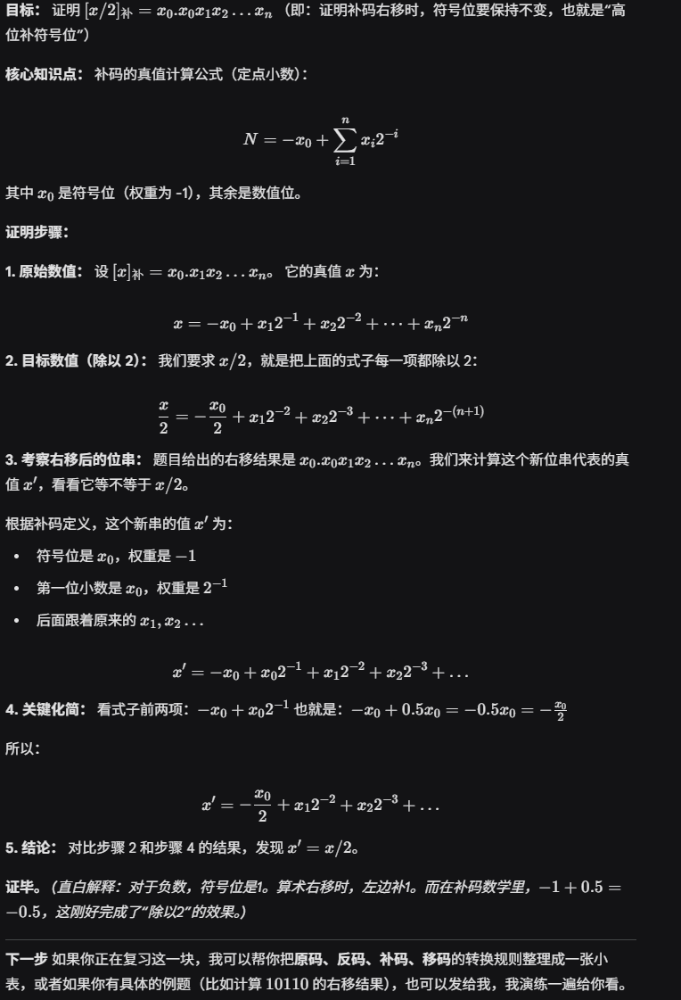

# ***知识点***

六个标志：

辅助进位：AF 低四位是否向高位进位

溢出：OF

符号位正负：SF

零标志：ZF

高位进位：CF 是否超过了表示范围

奇偶标志：PF

# ***必考题***

#### **补充一下布斯公式**

［X·Y］ ~补~ =［X］ ~补~ ·(-Y ~0~ +   ∑ Y ~i~ ·2 ^-i^ )

=［X］ ~补~ ·［-Y ~0~ +Y~1~2 ^-1^ +Y~2~2 ^-2^ +…+Y ~n~ ·2 ^-n^ ］

=［X］ ~补~ ·［-Y ~0~ +(Y ~1~ -Y~1~2 ^-1^ )+(Y~2~2 ^-1^ -Y~2~2 ^-2^ )+…

+(Y~n~2 ^-(n-1)^ -Y~n~2 ^-n^ )］

=［X］ ~补~ ［(Y ~1~ -Y ~0~ )+(Y ~2~ -Y ~1~ )2 ^-1^ +… +(Y ~n~ -Y ~n-1~ )2^-(n-1)^ +(0-Y ~n~ )2 ^-n^ ］

=［X］~补~   ∑  (Y ~i+1~ -Y ~i~ )2^-i^

#### **强调主存地址的题的做法模板，不要用有的教科书或者网上讲的三段的格式。**

设某计算机的cache采用8路组相联映像，已知cache容量为16KB，主存容量为2MB，每个字块有16个字，每个字有32位。若按字节编，请回答：主存地址各字段如何划分（各需多少位）？

主存地址21位。cache地址14位。

区号：7位

组号：5位

组内块号：3位（因为是8路）

块内字号：4位（因为一块有16个字）

字内字节号：2位（因为一个字有4个字节）

**别忘了画格子！**

---

# 证明题

---

